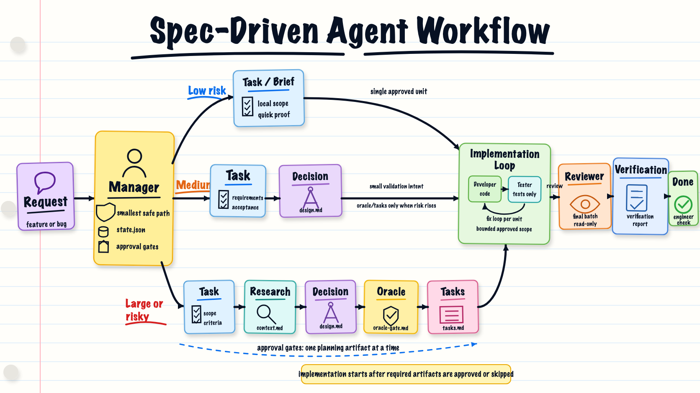

# Spec-Driven Development Workflow for AI Coding Agents

This repository contains a practical implementation of a Spec-Driven Development workflow for working with AI coding agents.

The workflow is designed around one engineering problem: AI agents can generate code quickly, but professional software delivery needs controlled scope, explicit intent, proof of correctness, and reviewable decisions.

Instead of sending an agent directly from request to code, this workflow scales the process by task risk. Small changes stay lightweight. Risky changes go through requirements, module/interface design with targeted research as needed, oracle proof, task breakdown, bounded implementation, validation, and review.



## Executive Summary

This is a lightweight governance model for AI-assisted engineering.

It treats requirements, design decisions, validation strategy, and agent role limits as first-class artifacts. The goal is not to create more documentation. The goal is to make AI-generated changes:

- easier to control
- easier to review
- easier to test
- easier to resume after context loss
- safer around public contracts, data, security, operations, and cross-module behavior

The central idea is simple:

> Define the intent and proof before asking an agent to implement.

Before medium or large work, use `project-specs` to create or refresh `steering/` when durable project facts are missing, stale, or unclear. Steering docs are the setup interface for future skills: they hold stable product purpose, technical constraints, and module/interface seams that agents should not rediscover every task.

## Workflow

The manager chooses the smallest safe path for each task.

```text
low risk:
task/brief -> implementation -> verification

medium risk:
task -> design with small oracle proof -> implementation -> verification

large or risky:
task -> design -> tasks -> implementation -> verification
```

Use `low` for tiny, localized, clear work.

Use `medium` when design or a small oracle proof would reduce churn, but task breakdown is not required by default.

Use `large` when design must settle current behavior, root cause, module seams, data, operations, integrations, or oracle proof before implementation.

Before medium or large planning, the manager checks whether `steering/` exists and looks relevant. Missing or stale steering does not block small work, but it should be called out before risky work so the engineer can approve a `project-specs` preflight or continue with lower confidence.

Use `design.md` for both targeted context research and oracle proof. `research-context` and `oracle-gate` are small helper skills that write sections inside `design.md`; they do not create separate default artifacts.

Planning is approval-gated one step at a time: the manager creates or refreshes one artifact, records state, and stops for engineer approval before moving to the next planning stage.

Implementation loops happen only inside the implementation stage. Developer runs each approved implementation task, reusing or improving existing behavior/contract tests before adding new ones, and runs the focused checks needed to prove the task. Reviewer then reviews that task on two separate axes: `Spec Review` checks accepted artifacts and scope, while `Standards Review` checks steering, module/interface principles, behavior-test guidance, repo conventions, proof coverage, and real maintainability risks. After all tasks pass review or approved skips, tester validates the integrated result against the design's `Oracle Gate` using `behavior-tests`. Agents must stop if product intent, design, oracle proof, or approved scope changes.

## Artifacts

Each task can produce a small set of durable artifacts under `tasks/<task-name>/`.

| Artifact | Purpose |
| --- | --- |
| `state.json` | Workflow state, current stage, artifact status, and routing notes. |
| `task.md` | Requirements, acceptance criteria, scope, risk flags, and interface impact. |
| `design.md` | Accepted module/interface design, options considered, tradeoffs, targeted context research, and oracle proof. |
| `tasks.md` | Ordered tracer-bullet implementation checklist with mode, outcome, check, and review scope for each task. |
| `verification-report.md` | Final verification summary: important proof, tests to inspect, manual checks, and residual risk. |

## Skills

The workflow is implemented as reusable agent skills. Each skill is plain Markdown so it can be adapted to different agent runtimes.

| Skill | Responsibility |
| --- | --- |
| [`project-specs`](skills/project-specs/SKILL.md) | Creates or refreshes `steering/`, the setup interface for durable product purpose, technical constraints, and module/interface seams. Use as preflight when medium/large work lacks reliable steering. |
| [`manager`](skills/manager/SKILL.md) | Owns workflow state, selects the smallest safe path, runs one step at a time, and stops for engineer approval at gates. |
| [`task-requirements`](skills/task-requirements/SKILL.md) | Captures feature work as user stories, observable rules, acceptance examples, routing facts, and questions. |
| [`bugfix-spec`](skills/bugfix-spec/SKILL.md) | Captures bugfix work as current behavior, expected behavior, unchanged behavior, reproduction, acceptance examples, routing facts, and questions. |
| [`research-context`](skills/research-context/SKILL.md) | Researches only the repo facts, external docs, options, and risks that change the design decision. |
| [`design-doc`](skills/design-doc/SKILL.md) | Records accepted module/interface decisions, options considered, tradeoffs, context research, oracle proof, and review scope. |
| [`oracle-gate`](skills/oracle-gate/SKILL.md) | Defines the smallest proof that can distinguish a correct implementation from a wrong one before coding starts. |
| [`breakdown`](skills/breakdown/SKILL.md) | Turns an accepted design and its oracle proof into tracer-bullet implementation slices with mode, outcome, check, and review scope. |
| [`verification-report`](skills/verification-report/SKILL.md) | Summarizes the most important proof after implementation, review, and final testing so an engineer knows which tests, E2E checks, and residual risks to inspect. |
| [`grill-me`](skills/grill-me/SKILL.md) | Resolves blocking or important product, architecture, system-design, interface, or proof questions one at a time. |
| [`architecture-principles`](skills/architecture-principles/SKILL.md) | Supports design and review with lightweight architecture rules: deep modules, seams, adapters, interface-first proof, and abstraction tradeoffs. |
| [`behavior-tests`](skills/behavior-tests/SKILL.md) | Guides developer/tester agents on how to write or review behavior-focused tests around stable module interfaces. |
| [`make-diagram`](skills/make-diagram/SKILL.md) | Produces high-level Mermaid module/interface diagrams that help newcomers understand a system shape in under 20 seconds. |
| [`module-interface-sketch`](skills/module-interface-sketch/SKILL.md) | Creates bright module/interface sketches that make seams and contracts understandable at a glance. |

## Agents

The workflow uses bounded agent roles with narrow ownership instead of one unrestricted implementation agent. The files below are role definitions that can be adapted to different agent runtimes.

| Agent | Responsibility |
| --- | --- |
| [`developer`](agents/developer.toml) | Implements exactly one approved task within accepted artifacts, runs focused checks, and reuses or improves existing tests before adding new ones. |
| [`reviewer`](agents/reviewer.toml) | Performs read-only review of one implemented task. Focuses on interfaces, module seams, proof coverage, scope drift, and risk-bearing changes. |
| [`tester`](agents/tester.toml) | Validates the completed implementation batch against accepted artifacts and the design's `Oracle Gate`. May edit tests only. Must not edit product code. |

The developer and reviewer loop runs per implementation task. Tester is the final integrated validation before `verification-report.md`, with per-task tester runs reserved for high-risk exceptions.

## Worked Example

Example request:

> Add password reset by email. Users should request a reset link, use it once before expiry, and keep existing login behavior unchanged.

Because this touches authentication and user account recovery, the manager routes it as a `large` task.

```text
tasks/add-password-reset/
  state.json
  task.md
  design.md
  tasks.md
  verification-report.md
```

`task.md` captures intent, rules, and acceptance examples:

```md
# Task: Add Password Reset

## User Stories
- As a user who forgot my password, I want to reset it by email, so that I can regain access to my account.

## Rules
- [REQ-1] When a user requests a password reset, the system shall send a reset link when the account exists.
- [REQ-2] When a reset token is used, the system shall accept it only once before expiry.
- [REQ-3] When normal email/password login is used, the system shall continue to behave as before.

## Acceptance Examples
### AC-1: Request Reset
Covers: `REQ-1`

Given an existing user
When they request a password reset
Then the system sends a reset link without exposing whether the email exists.
```

`design.md` records the module/interface decision, considered options, targeted research, and oracle proof:

```md
## Context Research
- Question: Should reset tokens be stored or signed?
- Evidence:
  - Repo: current auth module stores server-side session state.
  - Docs: email links can be forwarded, so single-use invalidation matters.
- Options:
  - Option A: Store hashed reset tokens with expiry.
  - Option B: Use signed stateless reset tokens.
- Decision impact: Stored tokens support single-use invalidation directly.
- Confidence: high

## Module / Interface Design
| Module | Seam | Interface | Change | Hidden Implementation |
| --- | --- | --- | --- | --- |
| Auth recovery | Password reset request/completion route | Request reset and complete reset behaviors | new | hashed tokens, expiry, invalidation |

## Options Considered
- Store hashed reset tokens with expiry.
- Use signed stateless reset tokens.

## Decision
- Store hashed reset tokens with expiry.
- Invalidate a token after successful use.
- Keep login/session behavior unchanged.

## Oracle Gate
| Claim | Oracle | Seam | Check | Failure it catches |
| --- | --- | --- | --- | --- |
| `AC-1` | specified | reset request interface | request reset returns same response for known/unknown email | account enumeration leak |
| `REQ-2` | contract | reset completion interface | token can be used once before expiry | reusable or expired reset token |

Verdict: `pass`

## Review Scope
- Interface changed: yes
- Risk flags: auth, security, privacy
- Reviewer mode: full
```

The oracle gate defines what must be proven before implementation starts. `behavior-tests` governs how developer and tester agents write or review the actual tests.

`tasks.md` turns approved scope into tracer-bullet implementation slices. Each task should cut through the needed modules/interfaces end to end, be demoable or independently verifiable, and declare whether it is `AFK` or `HITL`:

```md
- [ ] **T1: Request reset link**
  - **Mode:** `AFK`
  - **Covers:** `REQ-1`
  - **Outcome:** existing users can request a reset link without account enumeration
  - **Do:** add reset request path and hashed token persistence
  - **Check:** same route response for known and unknown email
  - **Review:** full, auth/privacy seam

- [ ] **T2: Complete reset once**
  - **Mode:** `AFK`
  - **Covers:** `REQ-2`, `REQ-3`
  - **Outcome:** token changes password once before expiry and does not break login
  - **Do:** add reset completion path and token invalidation
  - **Check:** single-use, expiry, and login regression tests
  - **Review:** full, security seam
```

After implementation, review, and final testing, `verification-report.md` gives the engineer the final check:

```md
## Verdict
- `ready_for_engineer_check`

## Spec Claims Covered
| Claim | Evidence | Status |
| --- | --- | --- |
| `AC-1` | `tests/auth/password_reset_test.py::test_request_does_not_reveal_account` | passed |
| `REQ-2` | `tests/auth/password_reset_test.py::test_token_is_single_use` | passed |

## Residual Risk
- Email delivery provider behavior was faked in tests; verify one real reset email in staging.
```

## What This Demonstrates

This repository is not just a prompt collection. It demonstrates an engineering approach to AI-assisted delivery:

- risk-based workflow selection
- explicit requirements and acceptance criteria
- bugfix specs with regression guardrails
- design that researches only decision-changing context before choosing an approach
- design approval before risky implementation
- oracle proof before code generation
- bounded developer, tester, and reviewer agents
- traceability from requirement to implementation task to validation
- verification reporting before final engineer acceptance
- workflow state that survives chat history loss
- human approval at meaningful gates

## Repository Structure

```text
.
  README.md
  agents/
    developer.toml
    tester.toml
    reviewer.toml
  skills/
    manager/
      SKILL.md
    task-requirements/
      SKILL.md
    bugfix-spec/
      SKILL.md
    research-context/
      SKILL.md
    design-doc/
      SKILL.md
    oracle-gate/
      SKILL.md
    breakdown/
      SKILL.md
    verification-report/
      SKILL.md
    grill-me/
      SKILL.md
    architecture-principles/
      SKILL.md
    behavior-tests/
      SKILL.md
    module-interface-sketch/
      SKILL.md
```

## Inspiration And References

This workflow is a practical adaptation inspired by existing work in spec-driven development, prompt-driven development, testing strategy, and test-oracle research.

- [Structured-Prompt-Driven Development](https://martinfowler.com/articles/structured-prompt-driven/) - Thoughtworks article on making LLM-assisted changes governable, reviewable, and reusable by treating prompts as first-class artifacts.
- [Understanding Spec-Driven-Development: Kiro, spec-kit, and Tessl](https://martinfowler.com/articles/exploring-gen-ai/sdd-3-tools.html) - Analysis of current SDD tools and the need for workflows that fit different task sizes.
- [Test Pyramid](https://martinfowler.com/bliki/TestPyramid.html) - Testing strategy background for balancing focused tests, service-level tests, and higher-level validation.
- [The Oracle Problem in Software Testing: A Survey](https://discovery.ucl.ac.uk/id/eprint/1471263/) - Research background for why defining expected behavior and proof matters in software testing.
- [Matt Pocock's Skills](https://github.com/mattpocock/skills) - Practical inspiration for packaging reusable AI-agent skills as explicit, shareable instructions.
