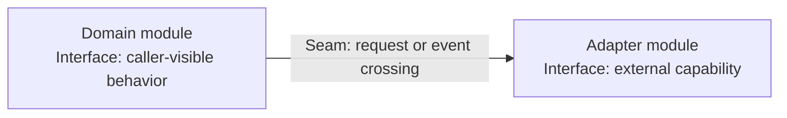

# Make Diagram

Produce a high-level Mermaid module/interface diagram that lets a newcomer understand the system shape in under 20 seconds.

This is an orientation skill, not a redesign skill. Do not propose refactors, architecture candidates, or new seams unless the user explicitly asks for recommendations.

## Language

Use `LANGUAGE.md` terms exactly:

- `Module`: anything with an interface and an implementation.
- `Interface`: everything a caller must know to use the module correctly.
- `Implementation`: the code inside.
- `Seam`: where an interface lives; a place behavior can be altered without editing in place.
- `Adapter`: a concrete thing satisfying an interface at a seam.

Use project domain vocabulary to name modules and seams. Use `LANGUAGE.md` vocabulary for architecture concepts.

## Inputs

Read the smallest useful set of sources:

1. Relevant `steering/` docs, especially `steering/structure.md` and its `Module Interface Map`.
2. Custom steering files when present, such as frontend design, testing, operations, or domain vocabulary notes.
3. Repo files only when steering is missing, stale, or too thin to draw the map.

If steering is missing or weak, inspect just enough repo evidence to draw a low-confidence map and say what evidence it is based on.

## Diagram Rules

- Use Mermaid `flowchart LR` by default.
- Keep the main map to 5-9 modules. If there are more, group them or make a second diagram.
- Show modules and adapters, not file inventories.
- Put stable interface facts in node labels.
- Label edges with what crosses the seam.
- Prefer domain names over technical class or file names when the domain concept owns the design decision.
- Do not expose implementation details unless they are necessary to understand why the interface exists.
- Avoid decorative complexity: no styling blocks unless needed for readability.

## Output

Return the diagram first, then a short readout.

````md
## System Map



## Read In 20 Seconds

- `Domain module` owns the main behavior.
- `Adapter module` hides external details behind its interface.
````

When confidence is not high, add:

```md
## Confidence

- `low | medium`: short reason
```
